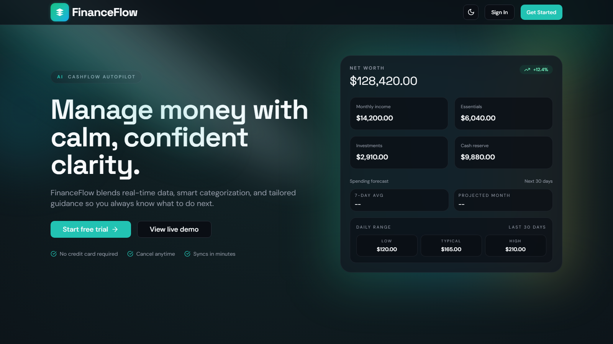
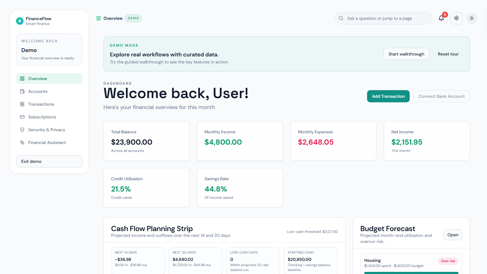
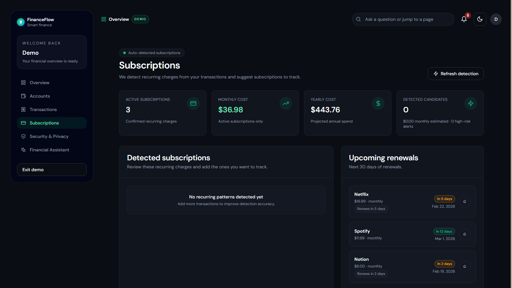
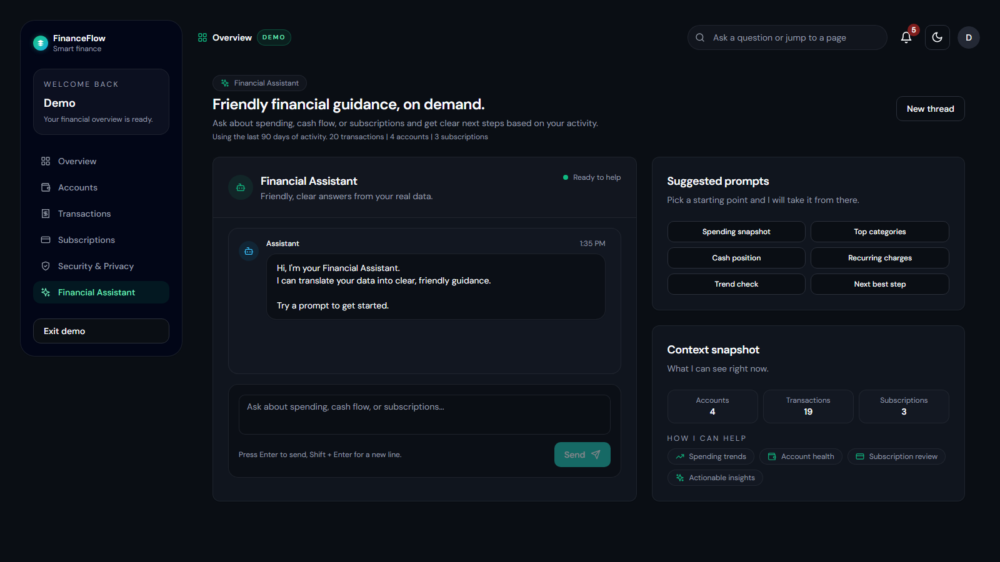

# Personal Finance Intelligence Platform

A production-style personal finance platform built with Next.js and TypeScript.
It combines transaction automation, budgeting intelligence, subscription analytics,
and an AI copilot into one cohesive dashboard experience.

[](https://nextjs.org/)
[](https://www.typescriptlang.org/)
[](https://www.prisma.io/)
[](https://tanstack.com/query/latest)
[](https://openrouter.ai/)

## Visual Tour

### Product walkthrough (GIF)


### Landing experience



### Dashboard command center



### Subscription intelligence



### AI assistant workspace



## Why this project stands out

- Full-stack architecture with real data modeling, API routes, and UI state orchestration.
- AI features integrated into real workflows, not isolated demos.
- High-signal dashboard UX with guided demo mode for instant product evaluation.
- Automated test and lint pipeline designed for shipping quality.

## Core capabilities

- Secure authentication with NextAuth and OAuth providers.
- Bank-ready data model for accounts, transactions, budgets, goals, and subscriptions.
- Auto-categorization pipeline with confidence review and bulk apply actions.
- AI financial insights panel and AI assistant with contextual finance prompts.
- Budget forecasting and cashflow planning surfaces.
- Subscription renewal intelligence with risk and price tracking.
- Demo mode that enables full product exploration without external setup.

## Tech stack

- Frontend: Next.js App Router, React, TypeScript, Tailwind CSS, Radix UI
- State and data: TanStack Query, Jotai
- Backend: Next.js Route Handlers, Prisma ORM
- Database: PostgreSQL
- Auth: NextAuth
- AI: OpenRouter
- Testing: Vitest, Testing Library

## Architecture snapshot

```text
src/
  app/
    (authenticated)/     # Main product surfaces (dashboard, assistant, subscriptions)
    api/                 # Route handlers for finance + AI operations
    auth/                # Login/register flows + demo mode entry
  components/            # Reusable UI and feature modules
  hooks/                 # Data hooks, demo mode hooks, UI behavior hooks
  lib/                   # Core utilities, AI helpers, demo data/session logic
  store/                 # Shared client state atoms
prisma/                  # Data schema and database access
tests/                   # Unit and integration test suites
scripts/                 # Utility scripts (secret checks)
```

## Quick start

### 1. Clone and install

```bash
git clone https://github.com/FrancoisCoding/personal-finance.git
cd personal-finance
npm install
```

### 2. Configure environment

Copy `env.example` to `.env` and fill required values.

### 3. Initialize database

```bash
npm run db:generate
npm run db:push
```

### 4. Run the app

```bash
npm run dev
```

Open `http://localhost:3000`.

## Environment variables

| Variable                            | Required            | Purpose                                    |
| ----------------------------------- | ------------------- | ------------------------------------------ |
| `PRISMA_DATABASE_URL`               | Yes                 | Primary Prisma PostgreSQL connection       |
| `DATABASE_URL`                      | Yes                 | Direct PostgreSQL connection               |
| `NEXTAUTH_URL`                      | Yes                 | Auth callback base URL                     |
| `NEXTAUTH_SECRET`                   | Yes                 | Session and JWT signing secret             |
| `NEXT_PUBLIC_APP_URL`               | Recommended         | Canonical app URL for metadata and links   |
| `GOOGLE_CLIENT_ID`                  | Optional            | Google OAuth provider                      |
| `GOOGLE_CLIENT_SECRET`              | Optional            | Google OAuth provider secret               |
| `GITHUB_ID`                         | Optional            | GitHub OAuth provider                      |
| `GITHUB_SECRET`                     | Optional            | GitHub OAuth provider secret               |
| `OPENROUTER_API_KEY`                | Yes for AI features | Hosted AI access                           |
| `OPENROUTER_MODEL`                  | Optional            | Override model ID                          |
| `OPENROUTER_BASE_URL`               | Optional            | OpenRouter base URL                        |
| `UPSTASH_REDIS_REST_URL`            | Recommended         | Distributed request-rate limiting backend  |
| `UPSTASH_REDIS_REST_TOKEN`          | Recommended         | Upstash REST auth token                    |
| `NEXT_PUBLIC_TELLER_APPLICATION_ID` | Optional            | Teller client application ID               |
| `NEXT_PUBLIC_TELLER_ENV`            | Optional            | Teller environment (`sandbox` recommended) |
| `TELLER_ENV`                        | Optional            | Teller server environment                  |
| `TELLER_CERT_PATH`                  | Optional            | Teller client certificate path             |
| `TELLER_KEY_PATH`                   | Optional            | Teller key path                            |

## Demo mode

You can evaluate the full product without creating external integrations:

1. Go to `http://localhost:3000/auth/login`
2. Click `Try the live demo`
3. Explore dashboard, subscriptions, transactions, and AI assistant

## Quality checks

```bash
npm run lint
npm run format:check
npm run test
```

## Deployment notes

- Vercel-friendly Next.js architecture.
- Prisma-based data layer compatible with managed Postgres providers.
- Environment-driven configuration for auth, AI, and bank integrations.

## Repository

- GitHub: https://github.com/FrancoisCoding/personal-finance
